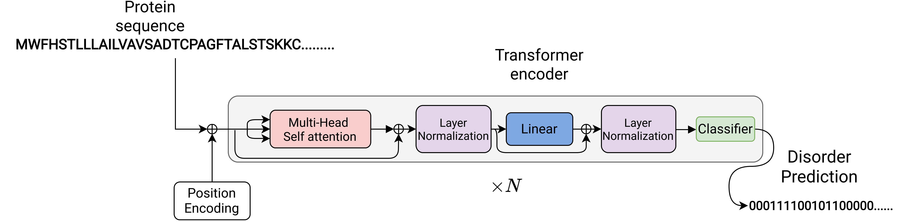

# Intrinsic disorder prediction on genomes and metagenomes
<div id="top"></div>
<!--
*** Thanks for checking out the Best-README-Template. If you have a suggestion
*** that would make this better, please fork the repo and create a pull request
*** or simply open an issue with the tag "enhancement".
*** Don't forget to give the project a star!
*** Thanks again! Now go create something AMAZING! :D
-->


<!-- PROJECT SHIELDS -->
<!--
*** I'm using markdown "reference style" links for readability.
*** Reference links are enclosed in brackets [ ] instead of parentheses ( ).
*** See the bottom of this document for the declaration of the reference variables
*** for contributors-url, forks-url, etc. This is an optional, concise syntax you may use.
*** https://www.markdownguide.org/basic-syntax/#reference-style-links
-->
[![Contributors][contributors-shield]][contributors-url]
[![Forks][forks-shield]][forks-url]
[![Stargazers][stars-shield]][stars-url]
[![Issues][issues-shield]][issues-url]
[![MIT License][license-shield]][license-url]
[![LinkedIn][linkedin-shield]][linkedin-url]


<!-- PROJECT LOGO -->
<br />
<div align="center">
  <a href="https://github.com/iliasprc/MScThesis">
    
  </a>

  <h3 align="center"></h3>

 
</div>


<!-- TABLE OF CONTENTS -->
<details>
  <summary>Table of Contents</summary>
  <ol>
    <li>
      <a href="#about-the-project">About The Project</a>
      <ul>
        <li><a href="#built-with">Built With</a></li>
      </ul>
    </li>
    <li>
      <a href="#getting-started">Getting Started</a>
      <ul>
        <li><a href="#prerequisites">Prerequisites</a></li>
        <li><a href="#installation">Installation</a></li>
      </ul>
    </li>
    <li><a href="#usage">Usage</a></li>
    <li><a href="#roadmap">Roadmap</a></li>
    <li><a href="#contributing">Contributing</a></li>
    <li><a href="#license">License</a></li>
    <li><a href="#contact">Contact</a></li>
    <li><a href="#acknowledgments">Acknowledgments</a></li>
  </ol>
</details>


<!-- ABOUT THE PROJECT -->
## About The Project

This repo contains the code implementation of my Thesis "Intrinsically disordered protein predictionfor genomes and metagenomes".


<p align="right">(<a href="#top">back to top</a>)</p>


### Built With

This section should list any major frameworks/libraries used to bootstrap your project. Leave any add-ons/plugins for the acknowledgements section. Here are a few examples.

* [PyTorch](https://pytorch.org/)


<p align="right">(<a href="#top">back to top</a>)</p>


<!-- GETTING STARTED -->
## Getting Started

This is an example of how you may give instructions on setting up your project locally.
To get a local copy up and running follow these simple example steps.

### Prerequisites


### Installation

_Below is an example of how you can instruct your audience on installing and setting up your app. This template doesn't rely on any external dependencies or services._

1. Get a free API Key at [https://example.com](https://example.com)
2. Clone the repo
   ```sh
   git clone https://github.com/iliasprc/IDPMetagenome.git
   ```

3. Install package requirements

 ```sh
 pip install -r requirements.txt
 ```

<p align="right">(<a href="#top">back to top</a>)</p>


<!-- USAGE EXAMPLES -->
## Usage

Use this space to show useful examples of how a project can be used. Additional screenshots, code examples and demos work well in this space. You may also link to more resources.

_For more examples, please refer to the [Documentation](https://example.com)_

<p align="right">(<a href="#top">back to top</a>)</p>

```commandline
python trainv2.py -c config/config_parse.yml
```

Arguments for training

```commandline
cwd: /home/ # working directory
logger: IDP # logger name
epochs: 30 # number of training epochs
seed: 123 # randomness seed
cuda: True # use nvidia gpu
gpu: 0 # id of gpu
save: True # save checkpoint
batch_size: 1
dim: 128
layers: 2
heads: 2
load: False # load pretrained checkpoint
gradient_accumulation: 8 # gradient accumulation steps
pretrained_cpkt: None
log_interval: 1000 # print statistics every log_interval
model: idprnn # model name   
pretrained: False
optimizer:  AdamW # optimizer type
lr: 1e-5 # learning rate
weight_decay: 0.00001 # weight decay
scheduler: ReduceLRonPlateau # type of scheduler
scheduler_factor: 0.8 # learning rate change ratio
scheduler_patience: 3 # patience for some epochs
scheduler_min_lr: 1e-5 # minimum learning rate value
scheduler_verbose: 5e-6 # print if learning rate is changed
dataset_type: classification
num_workers: 2
shuffle: True # shuffle samples after every epoch
dataset: MXD494
input_data: data_dir
name: MXD494 # dataset name
use_elmo: False
train_augmentation: True # do augmentation  
val_augmentation: False

```

<!-- ROADMAP -->
## Roadmap

- [x] Add Changelog
- [x] Add back to top links
- [ ] Add Additional Documentation
- [ ] Add additional methods for IDP


See the [open issues](https://github.com/iliasprc/IDPMetagenome/issues) for a full list of proposed features (and known issues).

<p align="right">(<a href="#top">back to top</a>)</p>


<!-- CONTRIBUTING -->
## Contributing

Contributions are what make the open source community such an amazing place to learn, inspire, and create. Any contributions you make are **greatly appreciated**.

If you have a suggestion that would make this better, please fork the repo and create a pull request. You can also simply open an issue with the tag "enhancement".
Don't forget to give the project a star! Thanks again!

1. Fork the Project
2. Create your Feature Branch (`git checkout -b feature/AmazingFeature`)
3. Commit your Changes (`git commit -m 'Add some AmazingFeature'`)
4. Push to the Branch (`git push origin feature/AmazingFeature`)
5. Open a Pull Request

<p align="right">(<a href="#top">back to top</a>)</p>


<!-- LICENSE -->
## License

Distributed under the MIT License. See `LICENSE.txt` for more information.

<p align="right">(<a href="#top">back to top</a>)</p>


<!-- CONTACT -->
## Contact

Ilias Papastratis 
- [Twitter](https://twitter.com/IPapastratis)
- [Mail](iliaspapastrat@gmail.com)

Project Link: [IDPMetagenome](https://github.com/iliasprc/IDPMetagenome)


<p align="right">(<a href="#top">back to top</a>)</p>


<!-- ACKNOWLEDGMENTS -->
## Acknowledgments

Use this space to list resources you find helpful and would like to give credit to. I've included a few of my favorites to kick things off!


* [MobiDB-lite](https://github.com/BioComputingUP/MobiDB-lite)
* [Evolutionary Scale Modeling](https://github.com/facebookresearch/esm)
* [Choose an Open Source License](https://choosealicense.com)


<p align="right">(<a href="#top">back to top</a>)</p>


<!-- MARKDOWN LINKS & IMAGES -->
<!-- https://www.markdownguide.org/basic-syntax/#reference-style-links -->
[contributors-shield]: https://img.shields.io/github/contributors/iliasprc/IDPMetagenome.svg?style=for-the-badge
[contributors-url]: https://github.com/iliasprc/IDPMetagenome/graphs/contributors
[forks-shield]: https://img.shields.io/github/forks/iliasprc/IDPMetagenome.svg?style=for-the-badge
[forks-url]: https://github.com/iliasprc/IDPMetagenome/network/members
[stars-shield]: https://img.shields.io/github/stars/iliasprc/IDPMetagenome.svg?style=for-the-badge
[stars-url]: https://github.com/iliasprc/IDPMetagenome/stargazers
[issues-shield]: https://img.shields.io/github/issues/iliasprc/IDPMetagenome.svg?style=for-the-badge
[issues-url]: https://github.com/iliasprc/IDPMetagenome/issues
[license-shield]: https://img.shields.io/github/license/iliasprc/IDPMetagenome.svg?style=for-the-badge
[license-url]: https://github.com/iliasprc/IDPMetagenome/blob/master/LICENSE.txt
[linkedin-shield]: https://img.shields.io/badge/-LinkedIn-black.svg?style=for-the-badge&logo=linkedin&colorB=555
[linkedin-url]: https://www.linkedin.com/in/ilias-papastratis-16819412a/
[product-screenshot]: images/screenshot.png
