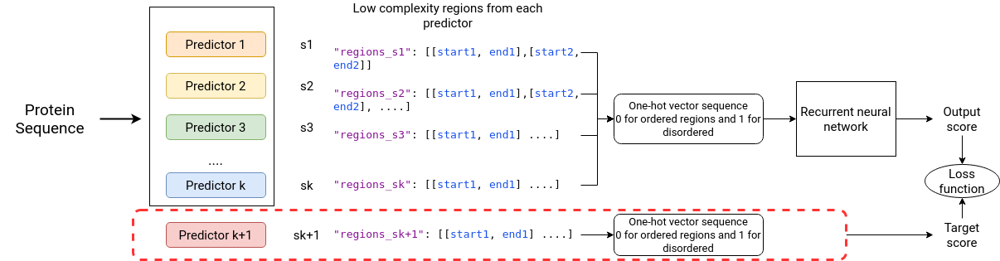

# IDP methods comparison

Framework for comparison of IDP methods


<div align="center">
  <a href="https://github.com/iliasprc/MScThesis">
    
  </a>

  <h3 align="center"></h3>

 
</div>

## Usage with RNN
```python
python idp_comparison/test_idp_predictors.py --test-predictor predictor
```

## Usage with Machine learning methods

```python
python idp_comparison/ml_idp_comparison.py --test-predictor predictor
```